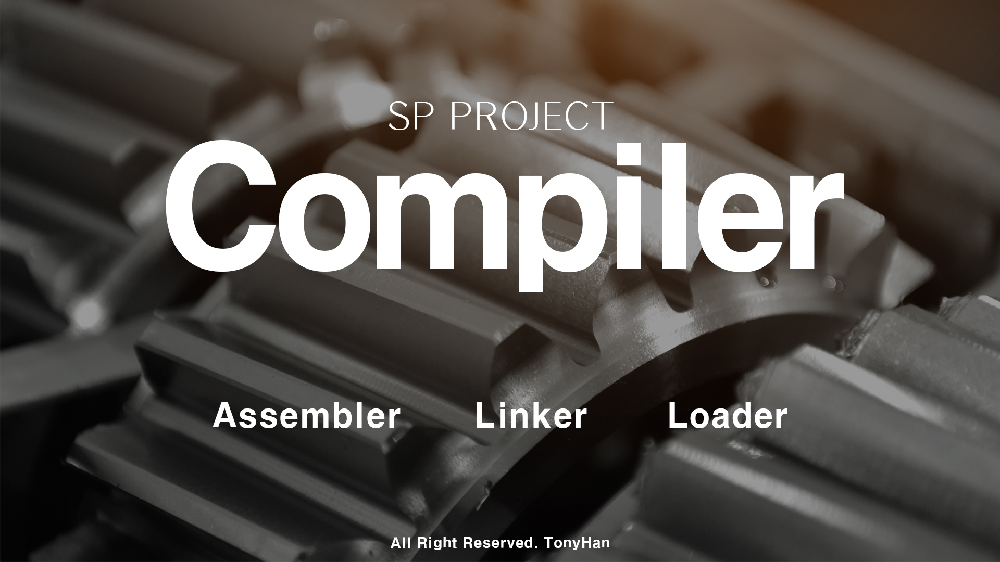

# CSE4100_System_Programming

What I learned 
  

 
1. Compiler 
:You can build, break and run your own .c file 
it will change to assembly file to object file and finally runnable file 
  

 
2. MyShell 
: You can run your own shell script or order by this Shell 
  

3. Concurrent StockServer 
: Actually this is a part of Operating System. You can run your own Concurrent Stock Server. It's protected from other thread or process. 

 

| Name | Link |
|---|---|
|Compiler | [https://github.com/tonyhan18/CSE4100_Assembler_Linker_Loader](https://github.com/tonyhan18/CSE4100_Assembler_Linker_Loader) |
|MyShell | [https://github.com/tonyhan18/CSE4100_C_SHELL](https://github.com/tonyhan18/CSE4100_C_SHELL) |
|StockServe | [https://github.com/tonyhan18/CSE4100_Stock_Server](https://github.com/tonyhan18/CSE4100_Stock_Server) |